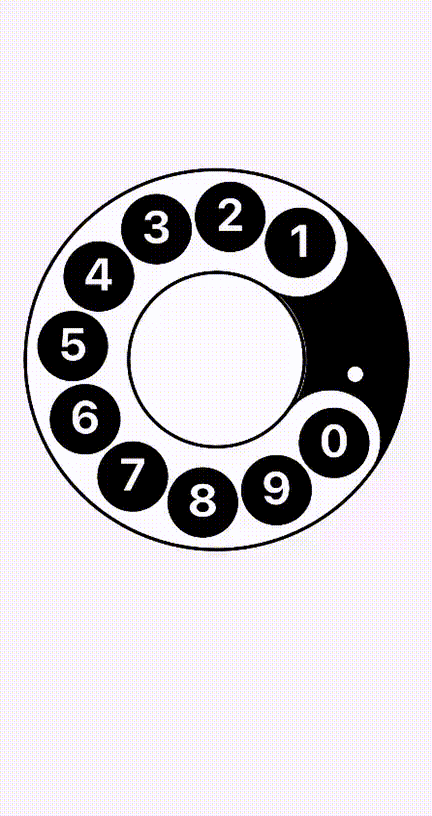

# rotary_dial

A smooth, customizable rotary dial widget for Flutter that emulates the behavior of a classic rotary telephone.



## Features

- **Realistic Physics**: Smooth rotation with spring-back animation.
- **Customizable Theme**: Control colors, gradients, sizes, strokes, and text styles.
- **Haptic Feedback**: Optional haptic feedback as the dial rotates.
- **Gesture Support**: Configurable hit regions and drag behavior.
- **Responsive**: Automatically adapts to available space or explicit size.

## Getting started

Add the package to your `pubspec.yaml`:

```yaml
dependencies:
  rotary_dial: ^1.0.3
```

## Usage

Import the package and use the `RotaryDial` widget. You can explicitly set the `size` property, or omit it to make the dial responsive to the available constraints:

```dart
import 'package:rotary_dial/rotary_dial.dart';

RotaryDial(
  size: 300, // Optional: explicitly sets width and height
  onDigitSelected: (digit) {
    print('Digit selected: $digit');
  },
  theme: const RotaryDialTheme(
    baseFillColor: Colors.black,
    ringFillColor: Colors.white,
    numberColor: Colors.white,
  ),
)
```

## Customization

The `RotaryDial` appearance and behavior can be fully customized. Here is an exhaustive example containing all available properties for easy reference:

```dart
RotaryDial(
  // ===== WIDGET PROPERTIES =====
  size: 300, // Optional: defaults to available constraints
  enableHaptics: true,
  onDigitSelected: (digit) => print('Digit selected: $digit'),
  onDialRotate: () => print('Dial rotating...'),

  // ===== THEME PROPERTIES =====
  theme: const RotaryDialTheme(
    // --- COLORS ---
    baseFillColor: Colors.black,
    baseGradient: null, // e.g., RadialGradient(...) overrides baseFillColor
    baseOutlineColor: Colors.black,
    centerFillColor: Colors.white,
    centerOutlineColor: Colors.black,
    ringFillColor: Colors.white,
    ringOutlineColor: Colors.black,
    ringGradient: null, // Overrides ringFillColor
    numberColor: Colors.white,
    activeNumberColor: Colors.amber,
    centerDigitColor: Colors.black, // Null defaults to baseFillColor
    dotColor: Colors.white,
    holeOutlineColor: Colors.black,
    activeHoleOutlineColor: Colors.amber,
    activeGlowColor: Colors.amber,

    // --- STROKES ---
    baseOutlineStrokePx: 3.0,
    centerOutlineStrokePx: 3.0,
    ringOutlineStrokePx: 3.0,
    holeOutlineStrokePx: 3.0,
    activeHoleOutlineStrokePx: 3.5,

    // --- SIZING FACTORS ---
    outerRadiusFactor: 0.98,
    innerRadiusFactor: 0.45,
    numberDistanceFactor: 0.37,
    numberSizeFactor: 0.13,
    dotRadiusFactor: 0.04,
    holeWidthFactor: 1.20,
    holeHeightFactor: 1.0,
    holeExtraWidthPx: 5.0,

    // --- TEXT STYLES ---
    numberTextStyle: TextStyle(fontWeight: FontWeight.w700, height: 1.0),
    centerTextStyle: TextStyle(fontWeight: FontWeight.w700, height: 1.0),

    // --- ACTIVE EFFECTS ---
    enableActiveGlow: true,
    activeNumberGlowSigma: 12.0,
    activeHoleGlowSigma: 8.0,
    activeNumberGlowRadiusFactor: 0.7,

    // --- GESTURE TUNING ---
    digitTouchAngleWindow: 0.24,
    gestureMinRadiusFactor: 0.30,
    gestureMaxRadiusFactor: 1.02,
    dragCancelMinRadiusFactor: 0.15,
    dragCancelMaxRadiusFactor: 1.30,

    // --- ANIMATION ---
    returnBaseMs: 300,
    returnExtraMs: 500,
    returnMinMs: 250,
    returnMaxMs: 800,
    returnCurve: Curves.easeOutCubic,
  ),
)
```
